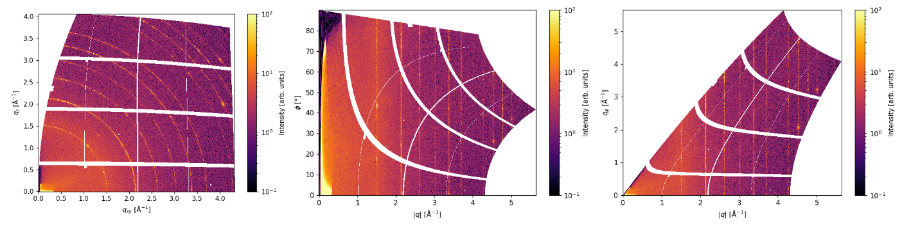

# _pygid_
## Fast preprocessing of Grazing Incidence Diffraction Data

<p align="center">
  
</p>

The package converts raw detector images into cylindrical, Cartesian, polar, and pseudopolar coordinates and saves the result as a NXsas file.

## Installation

### Install from source

First, clone the repository:
```bash
git clone https://github.com/mlgid-project/pygid.git
```

Then, to install all required modules, navigate to the cloned directory and execute:
```bash
cd pygid
pip install -e .
```

## How to use

Below is a short example of how to use the package.

```python
import pygid

# loading of poni-file and mask 
params = pygid.ExpParams( poni_path = 'LaB6_new.poni',
                    mask_path = 'mask.npy',
                    ai = 0.1,
                    fliplr = True, flipud = True, transp = False)

# creation of coordinate matrix based on given parameters
matrix = pygid.CoordMaps(params)

# Description of the experiment and samples to save with converted images. OPTIONAL
exp_metadata = pygid.ExpMetadata(
          start_time = r"2021-03-29T15:51:41.343788", 
          source_type = "synchrotron",
          source_name = "ESRF ID10",
          detector_name = "eiger4m",
          instrument_name = "ID10")


data = {
    "name": "240306_DIP",
    "structure": {
        "stack": "air | DIP 0-25| SiOx 1| Si",
        "materials": {
            "C60": {
                "name": "Diindenoperylene DIP",
                "thickness": 25,  #optional
                "cif": "DIP.cif",     #optional
                "type": "gradient film" #optional /layer
            },
            "SiOx": {
                "name": "native SiOx",
                "thickness": 1,
            },
            "Si": {
                "name": "Si wafer",
            }
        }
    },
    "preparation": "gradient thin film prepared by thermal evaporation",
    "experimental_conditions": "standard conditions, on air"
}
smpl_metadata = pygid.SampleMetadata(path_to_save="sample.yaml", data=data)

# data loading

data_path = "LaB6_0001.h5"
analysis = pygid.Conversion(matrix = matrix, path = data_path, dataset = '/1.1/measurement/eiger4m', frame_num = 0)

# Conversion
                    
analysis.det2q_gid(clims = (50, 8000), plot_result = True, return_result = False,
                   save_result = True, path_to_save = "result.h5",
                   exp_metadata = exp_metadata, smpl_metadata = smpl_metadata)
analysis.det2pol_gid(clims = (50, 800), plot_result = True, return_result = False, save_result = False)
analysis.det2pseudopol_gid(clims = (50, 800), plot_result = True, return_result = False, save_result = False)
              
```





### Detailed overview of package usage:


1. Import pygid
```python
import pygid
```

2. Create an instance of ExpParams class operating with experimental parameters. Load poni-file and mask.edf(/.npy/.tiff) (optional).
Use the fliplr and flipud keys to flip the raw image vertically and horizontally, respectively. Use the rot key to transpose the image relative to the left bottom corner.

```python
# loading of poni-file and mask (optional)
params = pygid.ExpParams(poni_path = 'LaB6.poni',                            # poni file location
                        mask_path = 'mask.npy',                              # mask file location (edf/tiff/npy)
                        fliplr = True, flipud = True, transp = False,        # flags for horizontal and vertical flipping and transpose
                        count_range = (10, 10000)                            # the intensity range is used to mask hot and dead pixels 
                        ai = [0, 0.05, 0.1])                                 # angle of incidence in GID experiments (in degrees) or list of angles
```
It is also possible to manually add experimental parameters. You should provide values for (poni1 and poni2) in meters or for beam positions (centerX and centerY) in pixels (relative to the bottom left corner). 
```python
params = pygid.ExpParams(
    fliplr = True,                      # Flag for horizontal flipping (left-right)
    flipud = True,                      # Flag for vertical flipping (up-down)
    transp = False,                     # Flag for applying rotation
    SDD = 0.3271661836504515,           # Sample-to-detector distance (in meters)
    wavelength = 0.6199,                # Wavelength (in angstroms)
    rot1 = -0.00263,                    # Detector rotation angle along the horizontal direction (X axis) (in radians)
    rot2 = -0.00465,                    # Detector rotation angle along the vertical direction (Y axis) (in radians)
    centerX = 2000,                     # Beam position in the horizontal direction (in pixels)
    centerY = 2145,                     # Beam position in the vertical direction (in pixels)
    px_size = 75e-6,                    # Detector pixel size (in meters)
    count_range = (10, 10000),          # the intensity range is used to mask hot and dead pixels 
    ai = 0                              # angle of incidence in GID experiments (in degrees) or list of angles     
)
```

Creation of poni-file based on a calibrant image using pyFAi-calib2 GUI is described in 
Ref.: https://www.silx.org/doc/pyFAI/latest/usage/cookbook/calib-gui/index.html 
 please use the Detector_config with the orientation set to 3 for the script to work correctly.

In case of angular scan, it is possible to load not only a single ai but also a list of incident angles, or a command that was called for the measurement of the angular scan using 
scan key as: scan = "ascan om 0.0400 0.1000 12 3" or "0.0400 0.1000 12". The ai list will be calculated automatically based on the scan string.
3. Create  ExpMetadata and SampleMetadata class element with a description of the experiment and the samples that you want to save with converted images in an NXsas format. All fields as well as the class element are optional.
All fields are optional. 
```python
exp_metadata = pygid.ExpMetadata(
          start_time = r"2021-03-29T15:51:41.343788", 
          source_type = "synchrotron",
          source_name = "ESRF ID10",
          detector_name = "eiger4m",
          instrument_name = "ID10")


data = {
    "name": "240306_DIP",
    "structure": {
        "stack": "air | DIP 0-25| SiOx 1| Si",
        "materials": {
            "C60": {
                "name": "Diindenoperylene DIP",
                "thickness": 25,  #optional
                "cif": "DIP.cif",     #optional
                "type": "gradient film" #optional /layer
            },
            "SiOx": {
                "name": "native SiOx",
                "thickness": 1,
            },
            "Si": {
                "name": "Si wafer",
            }
        }
    },
    "preparation": "gradient thin film prepared by thermal evaporation",
    "experimental_conditions": "standard conditions, on air"
}
smpl_metadata = pygid.SampleMetadata(path_to_save="sample.yaml", data=data)
```

4. Create CoordMaps instance (or list of CoordMaps using _make_CoordMaps_list_) based on ExperimentalParameters and incident angle ai (0 for transmission experiments). 
It is enough to calculate the coordinates only once for each incident angle.

```python
matrix = pygid.CoordMaps(params,                                                    # experimental parameters
                        q_xy_range = None, q_z_range = None, dq = 0.003,            # q-range and resolution (in A-1)
                        ang_min = 0, ang_max = 90, dang = 0.1,                      # angle range and resolution (in degrees)
                        hor_positive = False,  vert_positive = False,               # flags for only positive values of q in h
                        make_pol_corr= True,                                        # Flag to calculate polarization correction matrix
                        make_solid_angle_corr = True,                               # Flag to calculate solid angle correction matrix
                        make_air_attenuation_corr = False,                          # Flag to calculate air attenuation correction matrix
                        air_attenuation_coeff = 1,                                  # Linear coefficient for air attenuation correction (in 1/m)
                        make_sensor_attenuation_corr = False,                       # Flag to calculate sensor attenuation correction matrix
                        sensor_attenuation_coeff = 1,                               # Linear coefficient for sensor attenuation correction (in 1/m)
                        sensor_thickness = 0.1,                                     # Thickness of the detector sensor (in m)
                        make_absorption_corr = False,                                # Flag to calculate absorption correction matrix
                        sample_attenuation_coeff = 1,                               # Linear coefficient for sample attenuation correction (in 1/m)
                        sample_thickness = 200e-9,                                  # Thickness of the sample (in m)
                        make_lorentz_corr = False,                                  # Flag to calculate Lorentz correction matrix
                        powder_dim = 3,                                             # Dimension of powder for Lorentz correction: 2 or 3
                        dark_current = None,                                        # Array for dark current values
                        flat_field = None,                                          # Array for flat field correction values
                        path_to_save = 'matrix.pkl',                                # Path where coordinate map will be saved. Path format should be '.pkl'
                        path_to_load = None                                         # Path from which coordinate map will be loaded. Path format should be '.pkl'
                        )
         
```
One can save the coordinate matrices as pkl-file using path_to_save and load them path_to_load. However, the saving-loading time is comparable with the calculation time 

```python
matrix = pygid.CoordMaps(path_to_load = 'matrix.pkl') 
```

4. Create Conversion class instance based on raw data file (edf/tiff/cbf/h5) or list of files. 
In the case of h5 files, add dataset key like  'measurement/eiger4m' which is a root to the raw data in h5 file.
The key frame_num can be None/list of int/int and corresponds to the frames that will be loaded from the h5 file. 
Conversion takes matrix as a parameter. In case of angular scans, number of ai in experimental parameters should be equal to number of loaded images.

```
data_path = "LaB6_0001.h5"

analysis = pygid.Conversion(matrix = matrix,                                        # coordinate map
                      path = data_path,                                       # data file location (h5, tiff or edf) or list of them 
                      dataset = '1.1/measurement/eiger4m',               # raw image location in h5 file
                      frame_num = 0,                                          # list or number of necessary frame in series 
                      average_all = False,                                    # key for averaging of all frames 
                      roi_range = [0,500,0,500],                              # image range of interest 
                      )
                      
analysis = pygid.Conversion(matrix = matrix,                     # coordinate maps
      path = data_path,                                          # data file location (h5, tiff or edf) or list of them
      dataset = '/6.1/measurement/eiger4m',                      # raw image dataset location in h5 file
      frame_num = None,                                          # number of necessary frame in series. If None, will load all data in a dataset
      roi_range = [0, 1000, 0, 2000],                            # The range of the region of interest (ROI) (left, right, down, up). Default is [None, None, None, None] 
      average_all = False,                                       # Averages all loaded frames
      number_to_average = 2,                                     # The number of frames to average before processing
     )
```

5. Raw image plotting
```python
analysis.plot_raw_image(clims = (0.1, 100),                      # colormap limits
                        frame_num = 0,                           # number of frame to plot
                        xlim=(None, None), ylim=(None, None)     # X and Y image limits
                        )
                    
```

6. Remapping to reciprocal/polar/pseudopolar coordinates in reflection (GIWAXS) geometry 

```python
analysis.det2q_gid(clims = (50, 8000),                      # colormap limits 
                   frame_num = [0,1,2],                      # frame number or list of numbers to convert. If None, will convet all loaded frames   
                   plot_result = True,                      # flag to plot the result
                   return_result = False,                   # flag to return the result
                   save_fig = False,                        # flag to save the results as a picture
                   path_to_save_fig = "graph.tiff",          # path to save the image
                   radial_range = None,                    # radial range (in angstroms)
                   angular_range = (0,90),                # angular range (in degrees)
                   save_result = True,                      # flag to save the result as a NXsas (.h5) file
                   path_to_save = "result.h5",              # path to save the result with experimental params.
                   h5_group = "entry",                        # dataset name in the h5-file
                   overwrite_file = True,                    # the existing file will be overwritten of true
                   exp_metadata = exp_metadata, smpl_metadata = smpl_metadata                      # metadata that will be saved with result
                   )
analysis.det2pol_gid(clims = (50, 800), plot_result = True, return_result = False, frame_num = 0,
                      save_result = False)
analysis.det2pseudopol_gid(clims = (50, 800), plot_result = True, return_result = False, frame_num = 0,
                      save_result = False)         
                             
```


Remapping to reciprocal/polar/pseudopolar coordinates in transmission geometry 

```python
analysis.det2q(clims = clims,  frame_num = 0, plot_result = False)
analysis.det2pol(clims = clims,  frame_num = 0, plot_result = False)
analysis.det2pseudopol(clims = clims,  frame_num = 0, plot_result = False)
```

For all remapping functions the parameters are same. Dataset is automatically deleted after saving. 
Instead of path_to_save, it is possible to use key_to_change = ["str1", "str2"] that changes the path to the raw data   


Table 1. Conversion functions with description 

| Function        | Description                                          | Name of Output Image | Corresponding Matrix Coordinates |
|-----------------|------------------------------------------------------|------------------|----------------------|
| `det2q_gid()`   | GIWAXS coordinates                                   | `img_gid_q`      | `q_xy`, `q_z`        |
| `det2pol_gid()` | polar coordinates for GID experiments                | `img_gid_pol`    | `q_gid_pol`, `ang_gid_pol` |
| `det2pseudopol_gid()` | pseudopolar coordinates for GID experiments          | `img_gid_pseudopol` | `q_gid_azimuth`, `q_gid_rad` |
| `det2q()`       | Cartesian coordinates for transmission experiments   | `img_q`          | `q_x`, `q_y`         |
| `det2pol()`     | polar coordinates for transmission experiments       | `img_pol`    | `q_pol`, `ang_pol`   |
| `det2pseudopol()` | pseudopolar coordinates for transmission experiments | `img_pseudopol` | `q_azimuth`, `q_rad` |


7. Saving of NXsas (h5) file with all converted data. Not necessary if you used save_result = True.

```python
analysis.save_nxs(path_to_save  = "result.h5",    # location with the name (.h5) to save, or the key_to_change of the raw image path otherwise it will be saved to the same directory 
                  overwrite_file = False,               # the existing file will be overwritten if True
                  exp_metadata = exp_metadata, smpl_metadata = smpl_metadata)                    # Metadata class element
```

### Batch analysis

If you want to process more than batch_size (32 default), the Batch() function activates. At the initialization step, the images will not be loaded.
If one will use convertion functions, the raw data paths will be divided into batches and processed one-by-one. In this case, the functionality of the code is limited,
converted images will not be plotted, result cannot be returned, only saving is possible.

```python
analysis = pygid.Conversion(matrix = matrix, path = data_path, img_loc_hdf5 = '1.1/measurement/eiger4m',
                      batch_size = 32,                                                                       # maximum size of the batch (32 default)
                     )
analysis.det2pol_gid(clims = (50, 8000), plot_result = False, return_result = False,  multiprocessing = False,
                   save_fig = False, path_to_save_fig =  r"D:\PhD\X-ray data\2024_12_ESRF_ID10_Dima\analysis\241113_DBTTF_HATCN_grad_0001.tiff",
                   save_result = False, path_to_save = r"D:\PhD\X-ray data\2018_09_ESRF_Perovskite_local\test_converted5.h5" , overwrite_file = True, metadata = metadata)
            
```
### Line profiles and 1D integration

Radial and azimuthal profiles takes radial and angular ranges, performs polar integration and averages along angle or radial axes, respectively.
Horizontal profile makes transformation to the GID coordinates and averages in the given q_z range.  
```

q, i = analysis.radial_profile(key = "gid",                       # geometry: "gid" or "transmission"
                               plot_result = True,                # key to plot the result 
                               shift = 0.5,                       # shift between lines to plot
                               radial_range = None,               # radial range (in angstroms)
                               angular_range = (0,90),            # angular range (in degrees)
                               save_fig = False                   # key to save the image
                               path_to_save_fig = "graph.tiff",   # path to save the image
                               save_result = True,                # flag to save the result as a NXsas (.h5) file
                               path_to_save = "result.h5",        # path to save the result with experimental params.
                               return_result = True               # key to return result
                               )

phi, i = analysis.azim_profile(key = "gid", plot_result = True, shift = 0.5, radial_range = (1.34,1.4), angular_range = (0,180), return_result = True)
q_xy, i = analysis.horiz_profile( plot_result = True, shift = 1, q_xy_range = None, q_z_range = (0, 3), return_result = True)

```
Table 1. Conversion line profile functions 

| Function           | Description                                                    | Name of Output Image | Corresponding Matrix Coordinates |
|--------------------|----------------------------------------------------------------|----------------------|----------------------------------|
| `radial_profile()` | makes polar remapping and averages in the given angular range  | `rad_cut`            | `q_gid_pol` or `q_pol`           |
| `azim_profile()`   | makes polar remapping and averages in the given radial range   | `azim_cut`           | `ang_gid_pol` or `ang_pol`       |
| `horiz_profile()`  | makes cylindrical remapping and averages in the given qz range | `horiz_cut`          | `q_xy`                           |


### GID pattern simulation

This part is based on pygidSIM package that simulates GIWAXS patterns based on cif-file with crystal structure.   
pygid.Conversion.make_simulation plots the simulated data and converted image.

```python
result = analysis.make_simulation(
                                 frame_num=0,             # Frame number to plot   
                                 clims=(30, 8000),        # Intensity range for the color scale of experimental data 
                                 path_to_cif=struct.cif,  # Path to the .cif file containing the crystal structure  
                                 orientation=[1, 0, 0],   # Crystal orientation in space. None for the random orientation  
                                 min_int=5e-1,            # Minimum intensity threshold for display  
                                 plot_result=True,        # Whether to display the simulation result  
                                 cmap=cm.Blues,           # Colormap for visualization of simulated data  
                                 vmin=0.5, vmax=1,        # Normalization limits for the color scale of simulated data  
                                 linewidth=1.5,           # Simulated peaks line thickness for visualization  
                                 radius=0.1,              # Simulated peaks radius for visualization  
                                 plot_mi=False,           # Whether to plot Miller indices  
                                 return_result=True,      # Whether to return the simulation result  
                             )
```
The orientation parameter can be a list of single orientations. Then all given orientations will be plotted with the same .cif file.
The path_to_cif parameter can also contain a list of files. Then all structures will be plotted based on the given orientation.
If number of path_to_cif and orientation will be equal, they will be used respectively. 
min_int and cmap can also be lists for different structures or orientations. 
