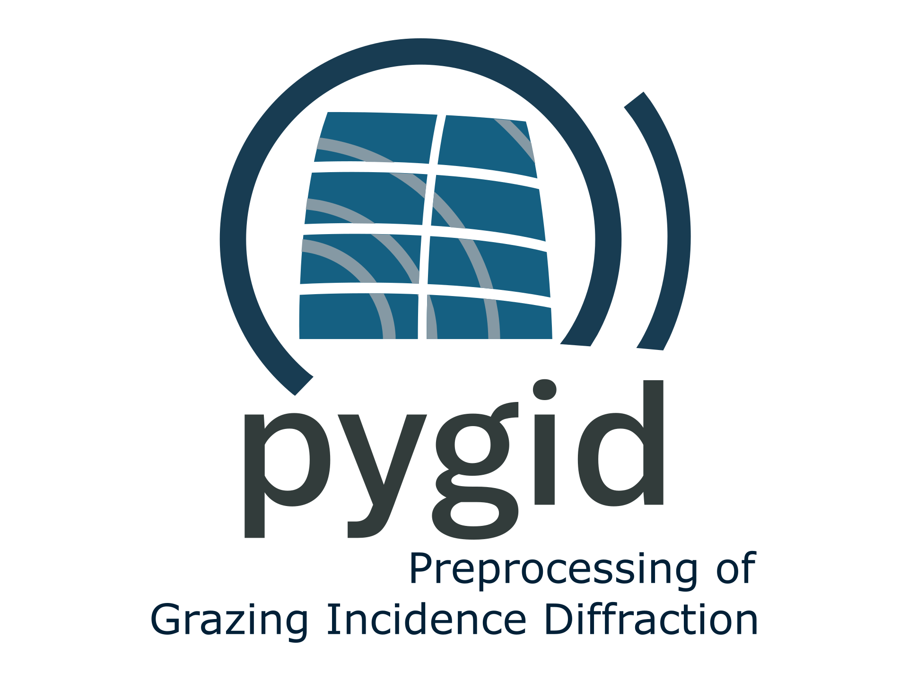

# pygid
[](https://pygid.readthedocs.io/en/latest/#)
[](https://zenodo.org/records/17466183)
[](https://journals.iucr.org/j/issues/2026/01/00/yr5162/index.html)
[](https://pypi.org/project/pygid/)
## Fast Preprocessing of Grazing Incidence Diffraction (GID) Data

`pygid` is a Python-based package for fast conversion of 2D detector images into reciprocal (Cartesian and polar) coordinates. Although the package focuses on the grazing-incidence geometry, it can also be used for transmission (SAXS/WAXS) experiments.  

Key features:  
- Supports **grazing-incidence and transmission geometries**.  
- Converts area detector images to **Cartesian, polar, and pseudopolar** coordinates.  
- Based on a widely used detector geometry description (**PONI files**).  
- Performs **radial and azimuthal** profiling.  
- Handles **single frames, multiple frames, and batch processing**.  
- Provides a wide range of intensity corrections, including **polarization, solid angle, absorption, Lorentz, and detector** corrections.  
- Utilizes **simulation of GIWAXS peak positions** using CIF crystal structure files (via `pygidSIM`).  
- Includes **experimental and sample metadata** management.  
- Allows **plotting** of the conversion results with adjustable parameters.  
- **Reuses the coordinate maps** for several images with the same geometry.  
- Supports **several interpolation techniques**.  
- Saves the results of conversion and metadata as a **NXsas** (NeXus) file.  
- Can be used as a first step in the [**`mlgid` analysis pipeline**](https://github.com/mlgid-project/mlgidBASE).

[//]: # (<p align="center">)

[//]: # (  )

[//]: # (</p>)

<p align="center">
  
</p>

### **Input**

- Experimental geometry parameters, e.g. a **PONI** file — see [Tutorial 1](./docs/tutorials/tutorial_01_experimental_parameters.ipynb).

- One of the following:
  - Detector image provided as a 2D **NumPy** array, a 3D array (with axis 0 representing the image stack axis) or list of 2D arrays.  
  - Path to the raw data file(s) (**TIFF**, **EDF**, **HDF5**) — see [Tutorial 3](./docs/tutorials/tutorial_03_raw_data_loading.ipynb).

### **Output**

- Image converted to reciprocal-space coordinates, returned together with the corresponding coordinate axes as **NumPy** arrays — see [Tutorial 4](./docs/tutorials/tutorial_04_2D_conversion.ipynb) and [Tutorial 5](./docs/tutorials/tutorial_05_line_profiling.ipynb).

- A standardized **NeXus** (HDF5) file — see [File format](./docs/tutorials/output_file_format.md).  
  For example, for cylindrical GID coordinates:
  - `img_gid_q` — converted image stored as a 3D array (with dimension #0 representing the image stack axis) under **/`entry`/data/img_gid_q**
  - `q_z` — corresponding vertical axis (first dimension) stored as a 1D array under **/`entry`/data/q_z**
  - `q_xy` — corresponding horizontal axis (second dimension) stored as a 1D array under **/`entry`/data/q_xy**

- Image exported in a standard format such as **PNG**, **TIFF**, or **JPEG**.
## Installation

### Install using pip

```bash
pip install pygid
```

### Install from source

First, clone the repository:

```bash
git clone https://github.com/mlgid-project/pygid.git
```

Then, to install all required modules, navigate to the cloned directory and execute:

```bash
cd pygid
pip install -e .
```

## How to use (short version)

Below is a minimal working example demonstrating how to use `pygid` to convert 2D detector images 
to reciprocal space coordinates in a grazing-incidence diffraction (GID) geometry.

1. Download example dataset from Zenodo or set your own files: 
```python
files = pygid.datasets.get_dataset("tutorial_00")
data_path = files["data_peaks"]
poni_path = files["poni_peaks"]
mask_path = files["mask_peaks"]
yaml_path = files["yaml"]
```

2. Load experimental parameters from the PONI file — see [Tutorial 1](./docs/tutorials/tutorial_01_experimental_parameters.ipynb)
```python
import pygid

params = pygid.ExpParams(
    poni_path=poni_path,        # path to the PONI file
    mask_path=mask_path,        # path to the mask file (EDF/ NPY/ TIFF)
    fliplr=True,                # horizontal flipping of the image
    flipud=True,                # vertical flipping of the image
    transp=False,               # 90 deg rotation of the image
    ai=0.075,                   # angle of incidence in degrees
)
```
3. **Enter sample and experimental metadata** — see [Tutorial 6](./docs/tutorials/tutorial_06_metadata_curation.ipynb)

#### Experimental Metadata (`ExpMetadata`)

Dictionary-like object containing experiment information:

```python
exp_metadata = pygid.ExpMetadata(
    start_time="2024-03-29T15:51:41.343788",
    end_time="2024-07-12T08:26:22Z",
    source_type="synchrotron",
    source_name="ESRF ID10",
    instrument_name="ID10-surf",
    detector="eiger4m",
    monitor=1.1e5,              # Optional
    extend_fields=["monitor"]   # Fields appended instead of overwritten
)
```
#### Sample Metadata (`SampleMetadata`)

Load sample information from a YAML file:

```python
smpl_metadata = pygid.SampleMetadata(
    path_to_load=yaml_path,
)
```
4. Create coordinate maps based on geometry and experimental setup  — see [Tutorial 2](./docs/tutorials/tutorial_02_coordinate_maps_and_corrections.ipynb)
```python
matrix = pygid.CoordMaps(
    params,
    vert_positive=False,        # Cut the positive values for the vertical axis
    hor_positive=False,         # Cut the positive values for the horizontal axis
)
```
5. Initialize pygid.Conversion instance and load the detector image  — see [Tutorial 3](./docs/tutorials/tutorial_03_raw_data_loading.ipynb)

```python
analysis = pygid.Conversion(
    matrix=matrix,
    path=data_path,             # path to the data file
)
```
6. Perform GID geometry conversion and plot the result, returns the axes and the converted image (list of images) — see [Tutorial 4](./docs/tutorials/tutorial_04_2D_conversion.ipynb)
```python
q_xy, q_z, img = analysis.det2q_gid(
    plot_result=True,                             # plot the result of conversion
    clims=(600, 1e5),                            # image color limits
    save_fig=True, path_to_save_fig="240124_PEN_DIP_polar.png",  # save figure
    return_result=True,                          # return arrays
    save_result=True, path_to_save="240124_PEN_DIP_result.h5",   # save data as a NXsas (NeXus) file
    overwrite_file=False,                        # overwrite the existing file
)
```

For a detailed description of functionality, follow the [tutorials](https://pygid.readthedocs.io/en/latest/#).  

Usage examples can be found in the Jupyter Notebook: [`example/pygid_example.ipynb`](example/pygid_example.ipynb), and on [Zenodo](https://doi.org/10.5281/zenodo.17466183) with data collected from different sources.  

## Citation
Abukaev, A., Völter, C., Romodin, M., Schwartzkopff, S., Bertram, F., Konovalov, O., Hinderhofer, A., Lapkin, D. and Schreiber, F., 2026. pygid: a Python package for fast data reduction in grazing-incidence diffraction. J. Appl. Cryst., 59(1).
doi: [10.1107/S1600576725010593](https://doi.org/10.1107/S1600576725010593)