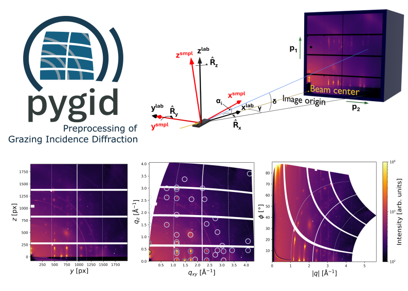

==================
pygid Documentation
==================

Welcome to the `pygid` documentation!

`pygid` is a Python-based package for fast conversion of 2D detector images into reciprocal (Cartesian and polar) coordinates. It focuses on grazing-incidence geometry but can also be used for transmission (SAXS/WAXS) experiments.

Key features include:

- Conversion of area detector images to **Cartesian, polar, and pseudopolar** coordinates.
- Support for **grazing-incidence and transmission geometries**.
- **Radial and azimuthal** profiling.
- Batch processing and metadata management.
- **Simulation of GIWAXS peak positions** using CIF files (`pygidSIM`).
- Saves results in **NXsas (NeXus) format**.
- Reusable coordinate maps for multiple images.
- Plotting and several interpolation techniques.

.. toctree::
   :maxdepth: 2
   :caption: Outline

   Quick Start
   tutorials_toctree
   File Format
