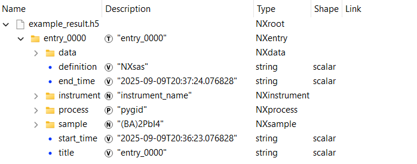
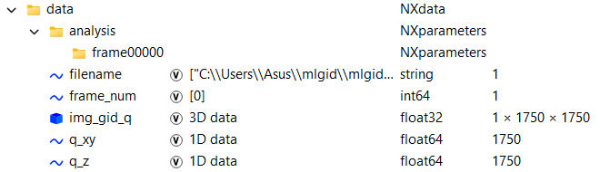
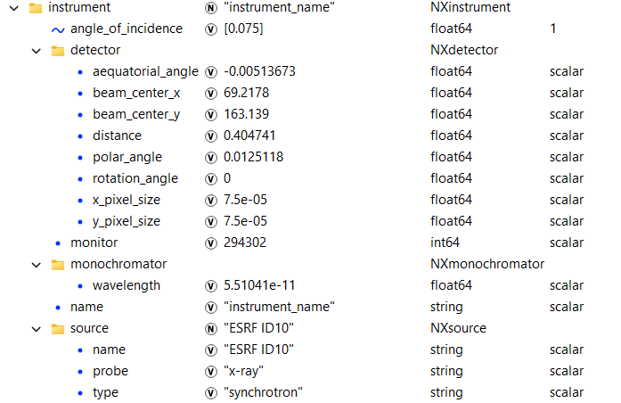
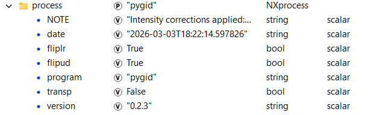
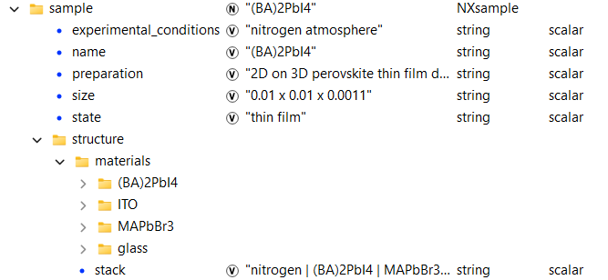

# Data format
To store individual converted images (datasets) with metadata and experimental parameters within a single file, we employ the
widely adopted [**NeXus** format](https://www.nexusformat.org/). The data type closely related to GIWAXS/GISAXS data is the 
[**NXsas**](https://manual.nexusformat.org/classes/applications/NXsas.html) application definition,
which was designed for storing small-angle scattering (SAS) data. 

However, we have slightly modified the data group to store arrays of scattering data for motor or time scans, as is
implemented in the **NXscan** definition. An additional
analysis group is used to store the results of further **mlgid** analysis steps.
Converted images can be stacked to the previously calculated data arrays if they have
the same shape and type, or can be saved in a separate NXentry
group. 

- The naming of datasets for different types of coordinates is shown in tables in Tutorials [4](./tutorial_04_2D_conversion.ipynb) 
and [5](./tutorial_05_line_profiling.ipynb). 
- The instrument group contains data from the **ExpParams** class, following the standard naming defined in
the **NXsas** format — see [Tutorial 1](./tutorial_01_experimental_parameters.ipynb).
- Additional information about the experiment and source can be added using the **ExpMetadata** class — see [Tutorial 6](./tutorial_06_metadata_curation.ipynb). 
- Details of the transformation, such as the date and the applied intensity corrections, are stored in the **process**
group.
- The **sample** group stores the sample-related metadata — see [Tutorial 6](./tutorial_06_metadata_curation.ipynb). 

After saving, the data can be visualized using **silx view** or obtained using **pygid.NexusFile** class (see [Tutorial 11](./tutorial_11_saved_data.ipynb)) 
or **h5py** package.

Below is an example of the file structure generated after conversion:

- `entry` group(s)

  

- Main `data` subgroup containing image(s) and corresponding axes

  

- `instrument` subgroup containing experimental parameters and metadata

  

- `process` subgroup containing conversion details

  

- `sample` subgroup containing sample metadata describing thin-film layered structure

  

